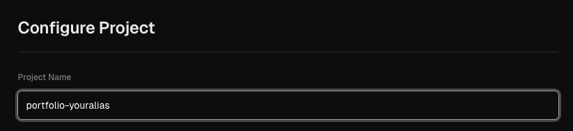

## Get started!

### How to copy the Portfolio Lab Project to your local machine

There are many ways to do this, but we'll show you how to set up your project with an SSH key.

</br>

### Prepare your SSH key

If you don't have an SSH key already, please read how to set up an SSH key with [GitHub Docs](https://docs.github.com/de/enterprise-cloud%40latest/authentication/connecting-to-github-with-ssh/generating-a-new-ssh-key-and-adding-it-to-the-ssh-agent).
If you already have an SSH key, then let's get started.

</br>

### Open the CLI

Open your terminal (Git Bash/ VSCode/ Command line).

> Note for windows user: The CLI (PowerShell) can cause issues when executing git commands. We recommend using Git Bash.

</br>
Change to the directory in which you want to clone the new repository.

```bash
cd documents/foldername/...
```

<div style="margin-left:30px;">
<details>
<summary style="font-weight:bold;">Optional: use one command line</summary>
</br>

```bash
# git clone <repo> <directory>

git clone git@github.com:mimibak/portfolio-testlab.git C:\documents\foldername
```

</br>

Note: You can open the CLI and run the clone command in one step by adding the directory at the end of your clone command. Let me know if you need further assistance! </br>
Change the directory to your new repository

```bash
cd documents/portfolio
```

</details>
</div>

</br>

### Run the clone command

Paste the copied SSH URL and run the clone command

```bash
git clone git@github.com:mimibak/portfolio-testlab.git
```

Change the directory to your new repository

```
cd portfolio-testlab
```

</br>
<hr>
</br>

### Connect GitHub with your new repository

1. Open <a href="https://github.com/" target="_blank">GitHub</a>

2. Create new repository<br>
   (click on the green button on the upper left side `New` or on the upper right side `+` > Create new repository)

   - Choose a repository name (we recommend: e.g. portfolio-yourname)

   - (Optional) Add a description to the repository

   - Set the repository to `public` or `private` </br>

   > (we recommend private: note that you're dealing with sensitive data and your privacy is important to us.)

   - Click the button `Create Repository`.

</br>
</br>

### Connect the local repository to the new GitHub repository

After creating your new GitHub repository, you'll see a "Quick setup" page. </br> Follow these steps:</br>

1. On the Quick setup page, make sure the `SSH` tab is selected.
2. Copy the `SSH URL`for your new repository. It should look like this: </br>

   ```bash
    git@github.com/username/your-repo-name.git
   ```

   You'll use it in the next step to update your local repository's remote URL.
   </br> </br>

   > Note: The URL you copy will have your actual GitHub username and the name of your new repository, not "username" and "your-repo-name".

</br>
</br>

### Switch to your CLI (VSCode/Terminal/Bash) and configure

In the following steps, you will set a new origin URL to change the remote connection.

1. Open a new terminal and navigate to your cloned repository </br>
   ```bash
    cd documents/foldername/your-repo-name
   ```
2. Set the new remote URL: </br>
   Replace `username` and `your-repo-name`with your actual GitHub username and the name of your new repository. </br>

   ```bash
    git remote set-url origin [Paste copied SSH URL]
   ```

3. Verify Changes:

   ```bash
   git remote -v
   ```

   #### It should display:

   ```bash
    origin  git@github.com:username/your-repo-name.git (fetch)
    origin  git@github.com:username/your-repo-name.git (push)
   ```

4. Push your local repository to the new GitHub repository:
   ```bash
   git push -u origin main
   ```

### Optional:

<div style="margin-left:20px">

Keep reference to the original repository. If you want to maintain a connection to the original Portfolio Lab repository:

```bash
git remote add og-portfolio-lab git@github.com:mimibak/portfolio-testlab.git
```

This allows you to fetch updates from the original repository while working on your own version

</div>

<br>
<br>

## Let's go live!

### Deployment with Vercel

Open Vercel and sign up with GitHub or login if you already have a Vercel account. </br>
Follow these steps to go live with your new portfolio:
</br>

<div align="center">

[Vercel Newbie](#newbies) </br>

[Vercel Ninja](#ninja)

</div>

</br>
</br>

<a id="newbies"></a>
**For Vercel Newbies:**

1. <a href="https://vercel.com/signup" target="_blank">Sign up to Vercel using your GitHub account</a>
   - click `Continue with GitHub`
2. Click on `Import Project` > `Import`[^1]
3. Click `+ Add GitHub Account`
4. Next a popup window shows: `Install Vercel`

   - Choose between `All repositories` or `Only select repositories`

     > When you selected `Only select repositories`, please choose `your-repo-name`

   - Click `install`

5. Select the repository you want to deploy
6. Configure your site settings:

   - Check the recommanded project name - you might want to change it </br>(note that this name will be part of your website link) </br>

    <figure>
    
    <figcaption>we recommend: portfolio-youralias</figcaption>
    </figure>

   - You can leave the build settings on default</br>Optional: Review build settings (for advanced users)

7. Click `Deploy` to start the deployment process
8. Wait for the deployment to complete. You can monitor the progress in the `Deploy`section
9. Once deployed, you will be redirected to a now side with a preview of your deployed page. Click on the image to view your live site.

   </br>
   </br>

<a id="ninja"></a>
**For Vercel Ninja**</br>

1. <a href="https://vercel.com/login" target="_blank">Login to Vercel using your GitHub account</a>
   - click `Continue with GitHub`
2. Click on `Import Project` > `Import`[^1]
3. Select the repository you want to deploy
4. Configure your site settings:

   - Check the recommanded project name - you might want to change it </br>(note that this name will be part of your website link) </br>

    <figure>
    
    <figcaption>we recommend: portfolio-youralias</figcaption>
    </figure>

   - You can leave the build settings on default</br>Optional: Review build settings (for advanced users)

5. Click `Deploy` to start the deployment process
6. Wait for the deployment to complete. You can monitor the progress in the `Deploy`section
7. Once deployed, you will be redirected to a now side with a preview of your deployed page. Click on the image to view your live site.

[^1]: If the desired GitHub repository is not listed, go to GitHub and check your Vercel configurations under Settings > Applications.

</br>

<details>
<summary style="font-weight:bold;">Optional: use custom domain</summary>
If you already have your own domain or want to buy one, you can proceed with step 2.
Set up a custom domain and don't forget to get the HTTPS cerificate if you connect your custom domain.
</details>

</br>

> Note: This process integrates your GitHub repository with Vercel, allowing for automated deployments whenever you push changes to your specified branch

</br>
</br>
